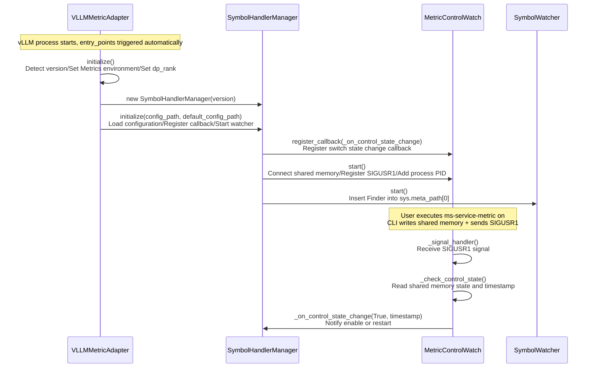
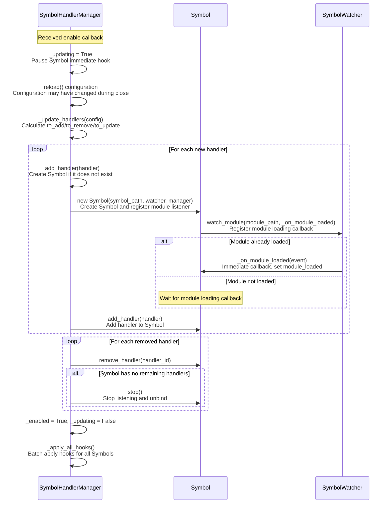
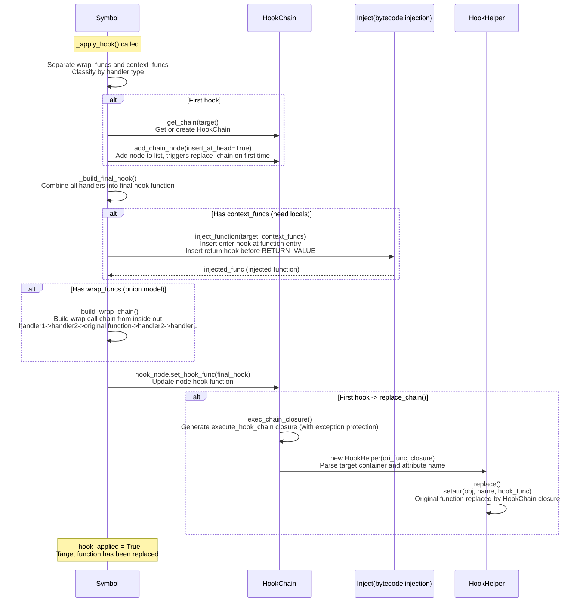
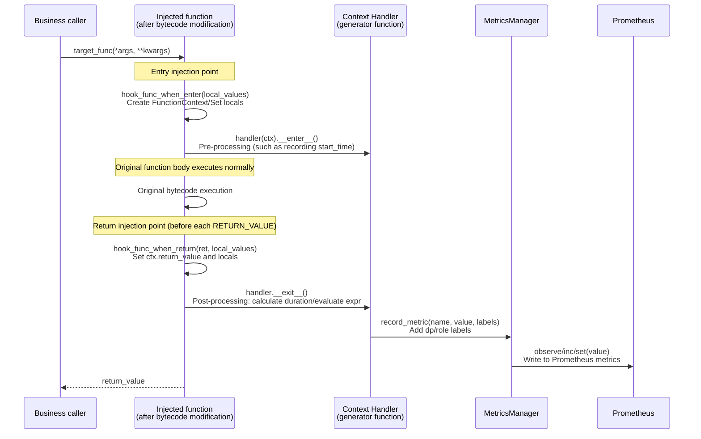
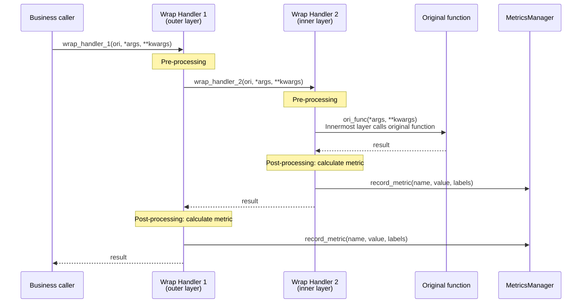

# ms\_service\_metric Design Document

## 1. Project Overview

### 1.1 Background

ms\_service\_metric is an independent metric module extracted from ms\_service\_profiler/patcher, released as a standalone library. It is primarily used to monitor and analyze performance metrics of services such as vLLM.

### 1.2 Goals

- Maintain functionality unchanged (unless specifically noted)
- Clear code structure with separated responsibilities
- Performance first, simplify hook function internal logic
- Support dynamic switch (shared memory + SIGUSR1 signal)
- Maintain external interface and configuration compatibility

### 1.3 Relationship with the Original Project

| Feature    | ms\_service\_profiler | ms\_service\_metric |
| --------- | --------------------- | ------------------- |
| Profiling | Supported              | Not supported       |
| Metrics   | Supported              | Supported           |
| Dynamic switch      | C++ callback                 | Shared memory + signal             |
| Standalone deployment      | Depends on C++               | Pure Python           |

## 2. Project Structure

```text
ms_service_metric/                           # Project root directory
├── pyproject.toml                           # Project configuration
├── README.md                                # Project description
├── DESIGN.md                                # Design document
├── ms_service_metric/                       # Main package (same name as the project)
│   ├── __init__.py                          # Package initialization
│   ├── __main__.py                          # Command-line entry point
│   ├── core/                                # Core module
│   │   ├── __init__.py
│   │   ├── symbol_handler_manager.py        # SymbolHandlerManager core class
│   │   ├── symbol.py                        # Symbol class
│   │   ├── handler.py                       # Handler abstract base class and MetricHandler implementation
│   │   ├── config/                          # Configuration-related modules
│   │   │   ├── __init__.py
│   │   │   ├── symbol_config.py             # SymbolConfig configuration class
│   │   │   └── metric_control_watch.py      # MetricConfigWatch class
│   │   ├── hook/                            # Hook-related modules
│   │   │   ├── __init__.py
│   │   │   ├── hook_chain.py                # HookChain class (doubly linked list for multi-hook management)
│   │   │   ├── hook_helper.py               # HookHelper class (function replacement helper)
│   │   │   └── inject.py                    # Bytecode injection
│   │   └── module/                          # Module-related modules
│   │       ├── __init__.py
│   │       └── symbol_watcher.py            # SymbolWatcher class (singleton)
│   ├── handlers/                            # Built-in handlers
│   │   ├── __init__.py
│   │   └── builtin.py                       # Built-in handler implementations (default_handler, and so on)
│   ├── adapters/                            # Framework adapters
│   │   ├── __init__.py
│   │   ├── vllm/                            # vLLM adaptation
│   │   │   ├── __init__.py
│   │   │   ├── adapter.py                   # vLLM adapter entry point
│   │   │   ├── metrics_init.py              # vLLM metrics initialization
│   │   │   ├── handlers/                    # vLLM-specific handlers directory
│   │   │   │   ├── __init__.py
│   │   │   │   ├── metric_handlers.py       # Metric handlers
│   │   │   │   └── meta_handlers.py         # Meta handlers
│   │   │   └── config/
│   │   │       ├── default.yaml             # vLLM default configuration
│   │   │       └── v1_metrics.yaml          # vLLM V1 metrics configuration
│   │   └── sglang/                          # SGLang adaptation
│   │       ├── __init__.py
│   │       ├── adapter.py                   # SGLang adapter entry point
│   │       └── config/
│   │           └── default.yaml             # SGLang default configuration
│   ├── metrics/                             # Metrics-related modules
│   │   ├── __init__.py
│   │   ├── metrics_manager.py               # MetricsManager class
│   │   └── meta_state.py                    # Metadata state management
│   ├── utils/                               # Utility module
│   │   ├── __init__.py
│   │   ├── expr_eval.py                     # Expression evaluation (ExprEval)
│   │   ├── exceptions.py                    # Exception definitions
│   │   ├── logger.py                        # Logging utility
│   │   ├── function_context.py              # Function context
│   │   └── shm_manager.py                   # Shared memory manager
│   └── control/                             # Control-side program
│       ├── __init__.py
│       └── cli.py                           # Command-line control tool (ms-service-metric)
└── tests/                                   # Test directory
    ├── __init__.py
    ├── conftest.py                          # pytest configuration and fixtures
    ├── test_config_compatibility.py         # Configuration compatibility tests
    ├── test_design.md                       # Test design document
    └── unit/                                # Unit tests
        ├── __init__.py
        ├── test_exceptions.py               # Exception class tests
        ├── test_expr_eval.py                # Expression evaluation tests
        ├── test_handler.py                  # Handler tests
        ├── test_hook_chain.py               # HookChain tests
        ├── test_logger.py                   # Logging utility tests
        ├── test_metrics_manager.py          # MetricsManager tests
        ├── test_symbol_config.py            # SymbolConfig tests
        ├── test_symbol_hook.py              # Symbol hook tests
        ├── test_symbol_watcher.py           # SymbolWatcher tests
        └── test_utils.py                    # Utility function tests
```

## 3. Core Class Design

### 3.1 SymbolHandlerManager (Core Management Class)

**Responsibilities:**

- Manage all handlers and Symbols
- Dynamically load and unload handlers and symbols based on configuration
- Serve as the core class that connects all other classes

**Key Design:**

1. Automatically manage Symbol objects based on handler additions and deletions
2. Simplify lock usage (only protect \_enabled and batch operation atomicity)
3. Batch apply\_hook instead of reapplying for each handler change
4. When opening, pause all symbol hook/unhook operations, then execute them all at once after completion
5. Support graceful stop, deciding whether to retain handlers based on the lock\_patch attribute

**Class Definition:**

```python
class SymbolHandlerManager:
    """Core management class for Symbol and Handler"""

    def __init__(self):
        self._config = SymbolConfig()
        self._watcher = SymbolWatcher()  # Singleton
        self._metrics_manager = get_metrics_manager()  # Singleton
        self._control_watch = MetricConfigWatch()
        self._symbols: Dict[str, Symbol] = {}
        self._handlers: Dict[str, Handler] = {}
        self._enabled = False
        self._lock = threading.Lock()
        self._updating = False

    def initialize(self, config_path: Optional[str] = None, default_config_path: Optional[str] = None):
        """Initialize all components"""

    def shutdown(self):
        """Shut down the manager"""

    def _on_control_state_change(self, is_start: bool, timestamp: int):
        """Control state change callback"""

    def _update_handlers(self, config: Dict[str, List[Dict]]):
        """Update handlers based on configuration"""

    def _add_handler(self, handler: Handler):
        """Add a handler, automatically manage the Symbol lifecycle"""

    def _remove_handler(self, handler_id: str):
        """Remove a handler; if the Symbol has no handlers, delete it automatically"""

    def _update_handler(self, handler: Handler):
        """Update a handler (direct replacement)"""

    def _apply_all_hooks(self):
        """Batch apply hooks for all symbols"""

    def _stop_all_symbols(self):
        """Stop all symbols"""

    def _stop_all_symbols_graceful(self):
        """Gracefully stop all symbols (supports lock_patch)"""

    def is_updating(self) -> bool:
        """Check if a batch update is in progress"""

    def is_enabled(self) -> bool:
        """Check if enabled"""
```

**Control State Processing Logic:**

```text
Close command (is_start=False):
  - If currently enabled, decide whether to retain handlers based on the lock_patch attribute
  - If currently disabled, no operation

Open command (is_start=True):
  - If currently enabled and timestamp is the same: duplicate command, no operation
  - If currently enabled and timestamp differs: restart, close all -> reload configuration -> reapply
  - If currently disabled: normal open, reload configuration -> apply
```

### 3.2 Symbol (Symbol Class)

**Responsibilities:**

- Represent a symbol that needs to be hooked
- Manage its handlers (duplicates not allowed)
- Directly listen to module loading events (without going through SymbolHandlerManager)
- Decide whether to execute hook/unhook based on Manager state
- Support graceful stop (lock\_patch feature)

**Class Definition:**

```python
class Symbol:
    """Symbol class, representing a symbol that needs to be hooked

    Uses HookChain to manage multiple Symbols hooking the same function to form a call chain.
    Supports inserting nodes at the head of the list (insert_at_head=True).
    """

    def __init__(
        self,
        symbol_path: str,
        watcher: "SymbolWatcher",
        manager: "SymbolHandlerManager"
    ):
        self._symbol_path = symbol_path
        self._module_path, self._attr_path = symbol_path.split(':', 1)
        self._handlers: Dict[str, Handler] = {}
        self._hook_applied = False
        self._module_loaded = False
        self._pending_hook = False
        self._watcher = watcher
        self._manager = manager
        self._hook_node: Optional[HookNode] = None  # HookChain node
        self._hook_chain: Optional[HookChain] = None  # HookChain instance
        self._target: Optional[Any] = None  # Cached imported target object

    @property
    def symbol_path(self) -> str:
        """Full symbol path"""

    @property
    def module_path(self) -> str:
        """Module path"""

    @property
    def hook_applied(self) -> bool:
        """Whether the hook has been applied"""

    def add_handler(self, handler: Handler):
        """Add a handler (duplicates not allowed)"""

    def remove_handler(self, handler_id: str):
        """Remove a handler"""

    def update_handler(self, handler: Handler):
        """Update a handler (direct replacement)"""

    def is_empty(self) -> bool:
        """Check if there are no handlers"""

    def hook(self):
        """Apply hook (public interface)"""

    def _apply_hook(self):
        """Internal core method: apply or update hook"""

    def unhook(self):
        """Restore the original function"""

    def stop(self):
        """Stop listening and unbind"""

    def stop_unlocked(self) -> Tuple[List[str], List[str]]:
        """Stop unlocked handlers, return (deleted ids, retained ids)"""

    def _build_final_hook(
        self,
        target: Any,
        ori_wrap: Any,
        wrap_funcs: List[Callable],
        context_funcs: List[Callable],
        chain: HookChain
    ) -> Callable:
        """Build the final hook function"""

    def _build_wrap_chain(self, target: Any, ori_wrap: Any, wrap_funcs: List[Callable]) -> Callable:
        """Build the wrap function chain (onion model)"""

    def _build_sync_wrap_chain(self, ori_wrap: Any, wrap_funcs: List[Callable]) -> Callable:
        """Build the synchronous wrap function chain"""

    def _build_async_wrap_chain(self, ori_wrap: Any, wrap_funcs: List[Callable]) -> Callable:
        """Build the asynchronous wrap function chain"""

    def _build_context_wrap_handler(self, wrap_chain: Any, context_funcs: List[Callable]) -> Callable:
        """Wrap context handlers into a single wrap handler"""

    def _build_hook_with_injection(
        self,
        target: Any,
        context_funcs: List[Callable],
        chain: HookChain,
    ) -> Callable:
        """Build a hook with bytecode injection"""
```

**Handler Merging Strategy:**

```text
1. Separate wrap handlers and context handlers
2. Execution order:
   a. context handlers (need locals) -> bytecode injection
   b. context handlers (do not need locals) -> wrapped as wrap handler
   c. wrap handlers -> direct wrapping (onion model)

3. Sample:
   original function -> injection(need_locals_handlers) -> context_wrap(no_need_locals_handlers) -> wrap_chain
```

**Onion Model Sample:**

```text
Configuration order: handler1, handler2, handler3
Execution order: handler1 -> handler2 -> handler3 -> original function -> handler3 -> handler2 -> handler1

wrap_chain construction:
  chain = target  # The innermost layer is the original function
  for wrap_func in reversed(wrap_funcs):  # Reverse traversal
      chain = create_layer(wrap_func, chain)
```

### 3.3 Handler (Handler Abstract Base Class)

**Responsibilities:**

- Define the base interface for Handler (abstract base class)
- All custom Handlers should inherit from this class

**Class Definition:**

```python
class Handler(ABC):
    """Handler abstract base class: defines the base interface required by Symbol"""

    @property
    @abstractmethod
    def id(self) -> str:
        """Get the handler unique identifier"""
        pass

    @abstractmethod
    def get_hook_func(self, target: Callable) -> tuple[HandlerType, Callable]:
        """Get the hook function, return (handler type, hook function)"""
        pass

    @property
    def name(self) -> str:
        """Get the handler name"""
        return self.id

    def __hash__(self) -> int:
        """Support hashing for set and dict"""
        return hash(self.id)

    def __eq__(self, other: object) -> bool:
        """Support equality comparison"""
        if not isinstance(other, Handler):
            return False
        return self.id == other.id
```

### 3.4 MetricHandler (Concrete Handler Implementation)

**Responsibilities:**

- Load built-in handlers or user-defined handlers
- Classify hook\_func into wrap\_func and context\_funcs
- Automatically detect handler type (through function signature)
- Provide a unique handler\_id (generated from the full path of hook\_func)
- Support metrics configuration
- Support lock\_patch attribute (not deleted on close)

**Class Definition:**

```python
class MetricHandler(Handler):
    """MetricHandler class: Handler implementation supporting metrics configuration"""

    def __init__(
        self,
        name: str,
        symbol_info: dict,
        hook_func: Callable,
        min_version: Optional[str] = None,
        max_version: Optional[str] = None,
        metrics_config: Optional[List[MetricConfig]] = None,
        lock_patch: bool = False
    ):
        self._name = name
        self._symbol_info = symbol_info
        self._symbol_path = symbol_info.get("symbol_path")
        self._hook_func = hook_func
        self._min_version = min_version
        self._max_version = max_version
        self._metrics_config = metrics_config or []
        self._lock_patch = lock_patch

        # Classify hook_func and determine handler_type
        handler_type, hook_func = self._classify_hook_func(hook_func)
        if handler_type != None:
            self._handler_type = handler_type
            self._hook_func = hook_func
        else:
            self._handler_type = None

        # Generate unique ID
        self._id = self._generate_id()

    @property
    def id(self) -> str:
        """Get handler ID"""

    @property
    def name(self) -> str:
        """Get handler name"""

    @property
    def symbol_path(self) -> str:
        """Get the symbol path this handler belongs to"""

    @property
    def handler_type(self) -> HandlerType:
        """Get handler type"""

    @property
    def lock_patch(self) -> bool:
        """Whether patch is locked (not deleted on close)"""

    def get_hook_func(self, target: Callable) -> tuple[HandlerType, Callable]:
        """Get the hook function"""

    def equals(self, other: 'MetricHandler') -> bool:
        """Compare whether two handlers are equal (considering configuration changes)"""

    def _classify_hook_func(self, func) -> HandlerType:
        """Classify hook_func as wrap_func or context_func"""

    def _create_context_manager(self, func: Callable) -> Optional[Callable]:
        """Attempt to convert a function into a context manager"""

    @classmethod
    def from_config(cls, config: Dict, symbol_path: str) -> 'MetricHandler':
        """Create a MetricHandler instance from configuration"""

    @staticmethod
    def _import_handler(handler_path: str) -> Callable:
        """Import a handler function"""

    @staticmethod
    def _parse_metrics_config(metrics_config: list) -> List[MetricConfig]:
        """Parse metrics configuration"""
```

**Handler Classification Rules:**

```text
- Generator function -> context_func, returns HandlerType.CONTEXT
  - 1 parameter (ctx): does not need locals
  - 2 parameters (ctx, local_values): needs locals
- ContextManager subclass -> context_func, returns HandlerType.CONTEXT
- Others -> wrap_func, returns HandlerType.WRAP
```

**Handler Function Signatures:**

```python
# Wrap Handler
def wrap_handler(ori_func, *args, **kwargs):
    # Pre-processing
    result = ori_func(*args, **kwargs)  # Must explicitly call the original function
    # Post-processing
    return result

# Context Handler (does not need locals, 1 parameter)
def simple_context_handler(ctx):
    # ctx: FunctionContext object
    # Pre-processing
    yield  # The original function executes here
    # Post-processing (can access ctx.return_value)

# Context Handler (needs locals, 2 parameters)
def advanced_context_handler(ctx, local_values):
    # ctx: FunctionContext object
    # local_values: locals dictionary of the function
    # Pre-processing
    yield  # The original function executes here
    # Post-processing (can access ctx.return_value and local_values)
```

### 3.5 FunctionContext (Function Context Class)

**Responsibilities:**

- Store function execution context (local\_values, return\_value)
- Provide convenient methods to access local\_values

**Class Definition:**

```python
class FunctionContext:
    """Function execution context"""

    def __init__(self):
        self._local_values: Optional[Dict[str, Any]] = None
        self.return_value: Any = None

    @property
    def local_values(self) -> Optional[Dict[str, Any]]:
        """Get the locals dictionary of the function"""

    @local_values.setter
    def local_values(self, value: Optional[Dict[str, Any]]):
        """Set the locals dictionary of the function"""

    def get(self, key: str, default: Any = None) -> Any:
        """Get a value from local_values, simulating the dict.get method"""

    def __getitem__(self, key: str) -> Any:
        """Support accessing local_values through ctx['var'] syntax"""

    def __contains__(self, key: str) -> bool:
        """Support checking whether a variable exists in local_values using 'var' in ctx syntax"""
```

**Usage Sample:**

```python
# Using in a context handler
def my_handler(ctx, local_values):
    # Pre-processing
    x = ctx.get('x', 0)  # Get local variable x, default value 0
    y = ctx['y']  # Use dictionary syntax directly
    if 'z' in ctx:  # Check whether the variable exists
        z = ctx.get('z')

    yield  # Original function executes

    # Post-processing
    result = ctx.return_value
```

### 3.6 HookChain (Hook Chain Management Class)

**Responsibilities:**

- Manage multiple hook functions using a doubly linked list
- Support dynamic addition, deletion, and invocation of hooks
- Support inserting nodes at the head or tail of the list
- Each Symbol creates a node; multiple Symbols can form a call chain
- Provide exception protection mechanism

**Class Definition:**

```python
class HookNode:
    """Hook linked list node"""

    def __init__(self, chain: 'HookChain', prev_node: Optional['HookNode'] = None):
        self.chain = chain
        self.hook_func = self.call_prev  # Default to calling the previous one
        self.prev_node = prev_node
        self.next_node: Optional[HookNode] = None

    @property
    def ori_wrap(self):
        """Return the wrapper of the next function in the call chain"""
        return self.call_prev

    def set_hook_func(self, hook_func: Callable):
        """Set the hook function of the current node"""
        self.hook_func = hook_func

    def call_prev(self, *args, **kwargs):
        """Call the previous hook function (onion model inward)"""
        if self.prev_node:
            return self.prev_node.hook_func(*args, **kwargs)
        else:
            return self.chain._call_ori_func(*args, **kwargs)

    def remove(self) -> bool:
        """Remove the current node from the linked list"""
        return self.chain.remove_chain_node(self)

    def recover(self):
        """Restore the original function (alias of remove)"""
        return self.remove()


class HookChain:
    """Hook linked list manager"""

    def __init__(self, ori_func: Callable):
        self.ori_func = ori_func
        self.head: Optional[HookNode] = None
        self.tail: Optional[HookNode] = None
        self._nodes: Dict[int, HookNode] = {}  # Dictionary using id(node) as key
        self._lock = threading.Lock()
        self._helper = None
        self._last_result = NO_RESULT  # Save the result of the last call

    def set_last_result(self, result):
        """Set the result of the last call"""

    def _call_ori_func(self, *args, **kwargs):
        """Call the original function and save the result"""

    def add_chain_node(self, insert_at_head: bool = False) -> HookNode:
        """Add a node, return HookNode

        Args:
            insert_at_head: If True, insert at the head of the list; otherwise insert at the tail (default)
        """

    def remove_chain_node(self, node: HookNode) -> bool:
        """Delete a node"""

    def get_chain_info(self) -> dict[str, Any]:
        """Get debug information about the chain"""

    def print_chain_info(self, action: str = "Info"):
        """Print debug information about the chain"""

    def exec_chain_closure(self):
        """Return the closure function that executes the hook chain, with exception protection mechanism"""

    def __call__(self, *args, **kwargs):
        """Call the last node in the linked list"""


def get_chain(ori_func: Callable) -> HookChain:
    """Get or create a HookChain (public function, with caching)"""
```

**Usage:**

```python
# Using hook_chain in the Symbol class
from ms_service_metric.core.hook.hook_chain import get_chain

class Symbol:
    def hook(self):
        # 1. Get or create chain
        self._hook_chain = get_chain(self._target)

        # 2. Add node at the head
        self._hook_node = self._hook_chain.add_chain_node(insert_at_head=True)

        # 3. Build the hook function (using ori_wrap as the next function in the call chain)
        final_hook = self._build_final_hook(
            self._hook_chain.ori_func,
            self._hook_node.ori_wrap,
            wrap_funcs,
            context_funcs,
            self._hook_chain
        )

        # 4. Set the hook function
        self._hook_node.set_hook_func(final_hook)

    def unhook(self):
        # Restore the original function by removing the node
        if self._hook_node:
            self._hook_node.remove()
            self._hook_node = None
```

**Exception Protection Mechanism:**

```python
def execute_hook_chain(*args, **kwargs):
    """Execute the hook chain, with exception protection mechanism

    Protection strategy:
    1. Reset _last_result to NO_RESULT first
    2. Execute the hook chain
    3. If an exception occurs during execution:
       - If _last_result is still NO_RESULT (indicating ori_func has not been called yet),
         actively call ori_func once and return
       - If _last_result is an exception (indicating ori_func threw an exception), re-raise it
       - If _last_result already has a normal value (indicating ori_func has been called successfully),
         return the saved result
    4. If execution completes normally, return the result of the hook chain
    """
```

### 3.7 HookHelper (Hook Helper Class)

**Responsibilities:**

- Handle specific function replacement and recovery
- Save the original function, support recovery
- Parse target objects (support functions, methods, class attributes)

**Class Definition:**

```python
class HookHelper:
    """Hook helper class

    Handles specific function replacement and recovery operations.
    Only handles simple function replacement; complex handler merging logic is handled by the Symbol class.
    """

    def __init__(self, target: Any, hook_func: Callable):
        self._target = target
        self._hook_func = hook_func
        self._original_func: Optional[Callable] = None
        self._replaced = False
        self._target_obj, self._target_name = self._parse_target(target)

    def _parse_target(self, target: Any) -> tuple:
        """Parse the target object, determine the container and attribute name"""

    def replace(self):
        """Apply hook, replace the target function"""

    def recover(self):
        """Restore the original function"""

    @property
    def is_replaced(self) -> bool:
        """Whether the hook has been applied"""

    @property
    def original_func(self) -> Optional[Callable]:
        """Original function"""
```

### 3.8 MetricsManager (Prometheus Metric Manager)

**Responsibilities:**

- Manage the registration, recording, and querying of all Prometheus metrics
- Support multiple metric types: Histogram, Counter, Gauge, Summary
- Provide label management and expression evaluation
- Support metric collection in multi-process environments
- Automatically add the dp label

**Class Definition:**

```python
class MetricType(str, Enum):
    """Metric type enumeration"""
    TIMER = "timer"          # Duration metric (implemented using Histogram)
    HISTOGRAM = "histogram"  # Histogram
    COUNTER = "counter"      # Counter
    GAUGE = "gauge"          # Gauge
    SUMMARY = "summary"      # Summary


@dataclass
class MetricConfig:
    """Metric configuration data structure"""
    name: str
    type: MetricType
    expr: str = ""
    buckets: Optional[List[float]] = None
    labels: Optional[Dict[str, str]] = None


class MetricsManager:
    """Prometheus metric manager"""

    def __init__(self):
        self._metrics: Dict[str, Any] = {}
        self._label_definitions: Dict[str, List[Dict[str, str]]] = {}
        self._registry: Optional[CollectorRegistry] = None
        self._metric_prefix: str = ""

    @property
    def metric_prefix(self) -> str:
        """Get the metric name prefix"""

    @metric_prefix.setter
    def metric_prefix(self, prefix: str):
        """Set the metric name prefix"""

    def _get_appropriate_registry(self) -> CollectorRegistry:
        """Get the appropriate Prometheus registry (supports multi-process)"""

    def _generate_custom_buckets(self, max_end: float = 1000, max_precision: int = 6) -> List[float]:
        """Generate custom histogram buckets"""

    def _add_prefix(self, metric_name: str) -> str:
        """Add a prefix to the metric name"""

    def _add_dp_label_name(self, label_names: Optional[List[str]] = None) -> List[str]:
        """Add the default dp domain label name to the metric"""

    def _add_dp_label_value(self, labels: Optional[Dict[str, str]] = None) -> Dict[str, str]:
        """Add the default dp domain label value to the metric"""

    def _sanitize_metric_name(self, name: str) -> str:
        """Sanitize the metric name to ensure compliance with Prometheus conventions"""

    def register_metric(
        self,
        metric_config: MetricConfig,
        label_names: Optional[List[str]] = None
    ) -> Optional[Any]:
        """Register a metric"""

    def add_label_definition(self, metric_name: str, label_name: str, expr: str):
        """Add a label definition"""

    def get_label_definitions(self) -> Dict[str, List[Dict[str, str]]]:
        """Get the label definition dictionary"""

    def record_metric(
        self,
        metric_name: str,
        value: Union[int, float],
        labels: Optional[Dict[str, str]] = None
    ) -> None:
        """Record a metric value"""

    def get_registry(self) -> Optional[CollectorRegistry]:
        """Get the registry in use"""

    def get_all_metrics(self) -> Dict[str, Any]:
        """Get all created metrics"""

    def get_or_create_metric(
        self,
        metric_name: str,
        label_names: Optional[List[str]] = None,
        metric_type: MetricType = MetricType.TIMER,
        buckets: Optional[List[float]] = None
    ) -> "MetricsManager":
        """Get or create a metric"""

    def clear_metrics(self):
        """Clear all metrics"""


# Global MetricsManager instance (singleton)
_metrics_manager_instance: Optional[MetricsManager] = None

def get_metrics_manager() -> MetricsManager:
    """Get the global MetricsManager instance"""
```

### 3.9 SymbolWatcher (Module Load Watcher, Singleton)

**Responsibilities:**

- Listen to Python module import events
- Notify registered callbacks when a module is loaded
- Manage callbacks by module, ensuring the confirmed module is loaded when the callback is invoked
- Singleton pattern, ensuring only one watcher instance globally

**Class Definition:**

```python
class ModuleEventType(Enum):
    """Module event type"""
    LOADED = "loaded"
    UNLOADED = "unloaded"


class ModuleEvent:
    """Module event"""

    def __init__(self, module_name: str, event_type: ModuleEventType, module=None):
        self.module_name = module_name
        self.type = event_type
        self.module = module


class SymbolWatchFinder(importlib.abc.MetaPathFinder):
    """Module import listener

    Listens to module import events by inserting into sys.meta_path.
    """

    def __init__(self, watcher: "SymbolWatcher"):
        self._watcher = watcher
        self._target_modules: Set[str] = set()

    def add_target_module(self, module_name: str):
        """Add a target module"""

    def remove_target_module(self, module_name: str):
        """Remove a target module"""

    def find_spec(self, fullname: str, path, target=None):
        """Find module spec, wrap the loader to trigger callbacks"""


class SymbolWatcher:
    """Symbol watcher (singleton)

    Multiple instantiations return the same object, ensuring only one watcher instance globally.
    """

    _instance: Optional["SymbolWatcher"] = None
    _initialized: bool = False
    _singleton_lock: threading.Lock = threading.Lock()

    def __new__(cls) -> "SymbolWatcher":
        """Ensure only one instance"""

    def __init__(self):
        """Initialize (only effective on the first call)"""

    def watch(self, callback: Callable[[str], None]):
        """Listen to all module loading events (global callback)"""

    def unwatch(self, callback: Callable[[str], None]):
        """Stop listening to all module loading events"""

    def has_global_callbacks(self) -> bool:
        """Check whether registered global callbacks exist"""

    def watch_module(self, module_name: str, callback: Callable[[ModuleEvent], None]):
        """Listen to events of a specified module"""

    def unwatch_module(self, module_name: str, callback: Callable[[ModuleEvent], None]):
        """Stop listening to events of a specified module"""

    def start(self):
        """Start the watcher (insert into sys.meta_path)"""

    def uninstall(self):
        """Uninstall the watcher (remove from sys.meta_path)"""

    def stop(self):
        """Stop the watcher"""

    def is_module_loaded(self, module_name: str) -> bool:
        """Check whether a module is loaded"""

    def _notify_module_loaded(self, module_name: str):
        """Notify module loading event"""
```

### 3.10 SymbolConfig (Configuration Management Class)

**Responsibilities:**

- Read YAML configuration files
- Read user configuration and default configuration
- Merge configurations, automatically assign default values
- Support two configuration formats: array format and dictionary format

**Class Definition:**

```python
class SymbolConfig:
    """Symbol configuration management class"""

    ENV_CONFIG_PATH = "MS_SERVICE_METRIC_CONFIG_PATH"

    def __init__(self,
                 user_config_path: Optional[str] = None,
                 default_config_path: Optional[str] = None):

    def load(self, config_path: Optional[str] = None, default_config_path: Optional[str] = None) -> Dict[str, List[dict]]:
        """Load and merge configuration"""

    def reload(self) -> Dict[str, List[dict]]:
        """Reload configuration"""

    def _load_default_config(self) -> dict:
        """Load default configuration"""

    def _load_user_config(self) -> dict:
        """Load user configuration"""

    def _load_yaml(self, path: str) -> dict:
        """Load a YAML file, supporting array format and dictionary format"""

    def _convert_array_config(self, config_list: list) -> dict:
        """Convert array format configuration to dictionary format"""

    def _merge_configs(self, default: dict, user: dict) -> dict:
        """Merge configurations (user configuration is appended after default configuration)"""

    def _fill_defaults(self):
        """Fill default values for configuration"""

    def get_config(self) -> Dict[str, List[dict]]:
        """Get current configuration"""

    def get_symbol_config(self, symbol_path: str) -> List[dict]:
        """Get configuration for a specified symbol"""
```

### 3.11 MetricConfigWatch (Metric Configuration Dynamic Watcher)

**Responsibilities:**

- Use posix\_ipc shared memory and SIGUSR1 signal for inter-process communication
- Support environment variable configuration for shared memory and semaphore name prefixes
- Simplified design: only start flag and timestamp are needed
  - start=False: disable metric collection
  - start=True: enable metric collection
  - Timestamp change indicates restart is needed (reload configuration)

**Class Definition:**

```python
class MetricConfigWatch:
    """Metric configuration watcher

    Uses posix_ipc shared memory and SIGUSR1 signal to implement dynamic switch control.
    Supports multi-process simultaneous listening; the control side can send signals to all processes simultaneously.
    """

    STATE_OFF = 0
    STATE_ON = 1

    def __init__(self, shm_prefix: Optional[str] = None, max_procs: Optional[int] = None):

    def register_callback(self, callback: Callable[[bool, int], None]):
        """Register state change callback"""

    def unregister_callback(self, callback: Callable[[bool, int], None]):
        """Unregister state change callback"""

    def start(self):
        """Start the watcher (called in the controlled process)"""

    def stop(self):
        """Stop the watcher"""

    def _register_signal_handler(self):
        """Register SIGUSR1 signal handler"""

    def _signal_handler(self, signum, frame):
        """SIGUSR1 signal handler function"""

    def _check_control_state(self):
        """Check control state"""

    def get_last_timestamp(self) -> int:
        """Get the last processed timestamp"""

    def is_enabled(self) -> bool:
        """Check whether currently in the enabled state"""

    @classmethod
    def set_control_state(cls, is_start: bool, shm_prefix: Optional[str] = None, force: bool = False):
        """Set control state (called by the control side)"""
```

### 3.12 SharedMemoryManager (Shared Memory Manager)

**Responsibilities:**

- Unified management of shared memory operations for ms\_service\_metric
- Memory layout definition (supports version compatibility)
- Shared memory creation/connection/disconnection/destruction
- Semaphore operations
- Data read/write (state, timestamp, process list)
- Process management (add, clean, validate)
- Send control commands and signals
- Version compatibility handling (read as much as available)

**Memory Layout Design:**

All offsets are relative to the start of the shared memory, using a version-compatible design:

```text
[Magic:4][Version:4][Header length:4][State:4][Timestamp:4][Process list offset:4][Header end marker:4][Process list length:4][Process list cursor:4][PID1:4][PID2:4]...[PIDn:4]
```

**Field Description (each is int32):**

- Magic (0x4D534D54 = "MSMT")
- Version number
- Header length (total bytes from start to end marker)
- State (STATE\_OFF=0/STATE\_ON=1)
- Timestamp
- Process list offset (relative to the start of shared memory)
- Header end marker (0xDEADBEEF)
- Process list length (circular list length)
- Process list cursor (current position of the circular list)
- Process ID array

**Version Compatibility Strategy:**

- Use magic and header end marker to validate memory format
- When version does not match, mark `_version_mismatch`, but try to read available fields
- Check whether a field is within the valid header length range through `_is_field_available(offset)`
- When the process list is not available, return an exception value (PROC\_LEN\_INVALID = -1)

**Class Definition:**

```python
class SharedMemoryLayout:
    """Shared memory layout definition (version-compatible design)"""

    # Header field offsets (relative to the start of shared memory)
    OFFSET_MAGIC = 0       # Magic (int32)
    OFFSET_VERSION = 4     # Version number (int32)
    OFFSET_HEADER_LEN = 8  # Header length (int32)
    OFFSET_STATE = 12      # State (int32)
    OFFSET_TIMESTAMP = 16  # Timestamp (int32)
    OFFSET_PROC_OFFSET = 20  # Process list offset (int32)
    OFFSET_HEADER_END = 24 # Header end marker (int32)

    HEADER_SIZE = 28  # Total header size

    # Process list field relative offsets (relative to the start of the process list)
    PROC_LIST_REL_OFFSET_LEN = 0     # Process list length field relative offset
    PROC_LIST_REL_OFFSET_CURSOR = 4  # Process list cursor field relative offset
    PROC_LIST_REL_OFFSET_DATA = 8    # Process list data start relative offset
    PROC_LIST_HEADER_SIZE = 8        # Process list header size (length + cursor)
    PROC_ENTRY_SIZE = 4              # Bytes occupied by each process ID


class SharedMemoryManager:
    """Shared memory manager"""

    # Exception value constants
    PROC_OFFSET_INVALID = -1  # Process list offset exception value
    PROC_LEN_INVALID = -1     # Process list length exception value

    def __init__(self, shm_prefix: Optional[str] = None, max_procs: Optional[int] = None):
        """Initialize the shared memory manager"""

    def connect(self, create: bool = True) -> bool:
        """Connect to shared memory

        When connecting to existing shared memory, automatically obtains the actual size
        and adjusts the memory mapping.
        If the size does not match, a warning is recorded but the actual size is used.
        """

    def disconnect(self):
        """Disconnect"""

    def destroy(self):
        """Destroy shared memory and semaphore (complete deletion)"""

    def lock(self):
        """Acquire the semaphore lock (blocking)"""

    def unlock(self):
        """Release the semaphore lock"""

    def semaphore_lock(self):
        """Acquire the semaphore lock (context manager)"""

    def read_int(self, offset: int) -> int:
        """Read int32 (unsigned) from shared memory"""

    def write_int(self, offset: int, value: int):
        """Write int32 (unsigned) to shared memory"""

    def _is_field_available(self, offset: int) -> bool:
        """Check whether the field at the specified offset is available (within valid header length range)"""

    def get_state(self) -> int:
        """Get current state (returns STATE_OFF if field is unavailable)"""

    def set_state(self, state: int):
        """Set state"""

    def get_timestamp(self) -> int:
        """Get timestamp (returns 0 if field is unavailable)"""

    def set_timestamp(self, timestamp: int):
        """Set timestamp"""

    def update_state_and_timestamp(self, state: int):
        """Update state and timestamp simultaneously"""

    def _get_proc_offset(self) -> int:
        """Get process list offset (returns PROC_OFFSET_INVALID if unavailable)"""

    def get_proc_len(self) -> int:
        """Get process list length (returns PROC_LEN_INVALID if unavailable)"""

    def get_proc_cursor(self) -> int:
        """Get process list cursor (returns 0 if unavailable)"""

    def get_all_procs(self) -> List[int]:
        """Get all valid process IDs (deduplicated, returns empty list if unavailable)"""

    def add_process(self, pid: Optional[int] = None) -> int:
        """Add a process to the list (returns -1 if unavailable)"""

    def add_current_process(self) -> int:
        """Add the current process to the list"""

    def cleanup_invalid_processes(self) -> int:
        """Clean up invalid processes (returns cleanup count, returns -1 if unavailable)"""

    def get_valid_processes(self) -> List[int]:
        """Get all valid process IDs (validate whether processes exist)"""

    def should_destroy(self) -> bool:
        """Check whether shared memory should be destroyed (state OFF and no valid processes)"""

    def send_control_command(
        self,
        is_start: bool,
        force: bool = False,
        send_signal: bool = True
    ) -> Tuple[bool, int, int, bool]:
        """Send a control command, return (success, signal count sent, invalid processes cleaned, whether change was actually executed)"""

    def get_status(self) -> dict:
        """Get complete status information (including version_mismatch flag)"""
```

### 3.13 Inject (Bytecode Injection Module)

**Responsibilities:**

- Insert hook code at function entry and return points through bytecode injection
- Support accessing function locals variables
- Support context manager type handlers (handlers that need locals)
- Support Python 3.8+ (different versions use different bytecode instructions)

**Class Definition:**

```python
def inject_function(
    ori_func: Callable,
    context_hook_funcs: List[Callable]
) -> Callable:
    """Injection function

    Insert hook code at function entry and return points through bytecode injection.
    Supports accessing function locals variables.

    Args:
        ori_func: Original function
        context_hook_funcs: Context manager function list
            Each function signature should be: def handler(ctx, local_values): yield

    Returns:
        The injected function
    """
```

### 3.14 MetaState (Process Metadata State Management)

**Responsibilities:**

- Provide independent metadata storage for each process
- Used to provide additional label information in metrics
- Support dynamic update and retrieval, for use by handlers
- Write operations are thread-safe; read operations are lock-free (allowing stale data to be read)

**Class Definition:**

```python
class MetaState:
    """Process metadata state class

    Each process has an independent MetaState instance, storing metadata information for that process.
    Supports dynamic update and retrieval.
    Note: The get() method does not acquire a lock, allowing stale data to be read for better performance.
    Python GIL guarantees the atomicity of dict.get() operations.
    """

    def __init__(self):
        self._data: Dict[str, Any] = {}
        self._lock = threading.Lock()  # Only for write operations

    def get(self, key: str, default: Any = None) -> Any:
        """Get metadata value (lock-free, allows reading stale data)"""

    def set(self, key: str, value: Any):
        """Set metadata value"""

    def update(self, data: Dict[str, Any]):
        """Batch update metadata"""

    def remove(self, key: str) -> bool:
        """Delete metadata"""

    def clear(self):
        """Clear all metadata"""

    def get_all(self) -> Dict[str, Any]:
        """Get all metadata"""

    def has(self, key: str) -> bool:
        """Check whether a key exists"""

    @property
    def dp_rank(self) -> int:
        """Get data parallel rank (convenience property)"""

    @property
    def model_name(self) -> str:
        """Get model name (convenience property)"""


# Global MetaState instance (singleton)
_meta_state_instance: Optional[MetaState] = None

def get_meta_state() -> MetaState:
    """Get the global MetaState instance (singleton pattern)"""

def reset_meta_state():
    """Reset the global MetaState instance"""

def get_dp_rank() -> int:
    """Get the dp_rank of the current process"""

def set_dp_rank(rank: int):
    """Set the dp_rank of the current process"""

def get_model_name() -> str:
    """Get the model name of the current process"""

def set_model_name(name: str):
    """Set the model name of the current process"""
```

### 3.15 ExprEval (Expression Evaluator)

**Responsibilities:**

- Support safe mathematical expression evaluation
- Can be used for expression calculation in configuration
- Support variables, function calls, attribute access, subscript access, and other operations

**Class Definition:**

```python
class ExprEval:
    """Expression evaluator

    Parses and evaluates mathematical expressions, supporting the following features:
    - Basic math operations: +, -, *, /, //, %, **
    - Variable references: get variable values from params
    - Function calls: abs, round, len, max, min, and so on
    - Attribute access: obj.attr
    - Subscript access: list[index], dict[key]
    """

    OPERATOR = {
        ast.Add: operator.add,
        ast.Sub: operator.sub,
        ast.Mult: operator.mul,
        ast.Div: operator.truediv,
        ast.Pow: operator.pow,
        ast.USub: operator.neg,
        ast.UAdd: operator.pos,
        ast.FloorDiv: operator.floordiv,
        ast.Mod: operator.mod,
    }

    FUNCTION = {
        'abs': abs, 'round': round, 'len': len, 'int': int,
        'float': float, 'str': str, 'max': max, 'min': min,
        'pow': pow, 'sqrt': math.sqrt, 'sin': math.sin,
        'cos': math.cos, 'tan': math.tan, 'log': math.log,
        'exp': math.exp, 'ceil': math.ceil, 'floor': math.floor,
    }

    def __init__(self, expression: str):
        """Initialize the expression evaluator"""

    def __call__(self, params: Dict[str, Any], *args, **kwargs) -> Any:
        """Evaluate the expression"""

    def register_function(self, name: str, func: Callable):
        """Register a custom function"""


def evaluate_expression(expression: str, params: Dict[str, Any]) -> Any:
    """Convenience function: evaluate an expression"""
```

### 3.16 Built-in Handlers (builtin.py)

**Responsibilities:**

- Provide commonly used built-in handler functions
- Can be used directly in configuration

**Main Functions:**

```python
def default_handler(metrics_config: List[MetricConfig], is_async: bool = False, **kwargs) -> Callable:
    """Create the default handler

    Determines whether locals are needed based on whether the metrics configuration contains an expr field:
    - With expr: needs locals, creates a 2-parameter context handler
    - Without expr: does not need locals, creates a 1-parameter context handler or wrap handler

    Supports both synchronous and asynchronous functions.
    """
```

### 3.17 CLI Control Tool (cli.py)

**Responsibilities:**

- Provide a command-line interface for controlling metric collection switch in target processes
- Communicate with target processes through shared memory and SIGUSR1 signal

**Usage:**

```bash
ms-service-metric on      # Enable metric collection
ms-service-metric off     # Disable metric collection
ms-service-metric restart # Restart metric collection (reload configuration)
ms-service-metric status  # View status
```

**Environment Variables:**

- `MS_SERVICE_METRIC_SHM_PREFIX`: Shared memory and semaphore name prefix (default: /ms\_service\_metric)
- `MS_SERVICE_METRIC_MAX_PROCS`: Maximum number of processes (default: 1000)

## 4. Configuration Format

### 4.1 Array Format (Compatible with Original Configuration)

```yaml
- symbol: module.path:ClassName.method_name
  handler: module.path:function_name  # Optional
  min_version: "0.1.0"  # Optional
  max_version: "1.0.0"  # Optional
  lock_patch: false  # Optional, when true this handler is not deleted on close
  metrics:
    - name: metric_name
      type: timer
      expr: "duration"  # Optional, locals are needed when expr is present
      buckets: [0.1, 0.5, 1.0]  # Optional
      labels:
        - name: label_name
          expr: "expression"

- symbol: module.path:ClassName.method_name
  metrics:  # Use default handler when no handler is specified
    - name: metric_name
      type: timer
```

### 4.2 Dictionary Format

```yaml
module.path:ClassName.method_name:
  - handler: module.path:function_name
    metrics:
      - name: metric_name
        type: timer
```

## 5. Key Flows

### 5.1 Initialization Flow

```text
SymbolHandlerManager.initialize()
  ├── Load configuration (SymbolConfig.load)
  ├── Register control callback (_on_control_state_change)
  ├── Start control watcher (MetricConfigWatch.start)
  └── Start module watcher (SymbolWatcher.start)
```

### 5.2 Module Loading Flow

```text
Module import
  └── SymbolWatchFinder.find_spec
       └── LoaderWrapper.exec_module
            └── SymbolWatcher._notify_module_loaded
                 └── Symbol._on_module_loaded
                      └── Symbol.hook (if not in batch update)
                           └── Symbol._apply_hook
                                ├── Create/reuse HookChain
                                ├── Build final_hook
                                └── Set hook function
```

### 5.3 Control Command Processing Flow

```text
Receive SIGUSR1 signal
  └── MetricConfigWatch._signal_handler
       └── MetricConfigWatch._check_control_state
            └── SymbolHandlerManager._on_control_state_change
                 ├── Close: _stop_all_symbols_graceful
                 │    └── Symbol.stop_unlocked (based on lock_patch)
                 ├── Reload configuration: SymbolConfig.reload
                 ├── Update handlers: _update_handlers
                 └── Apply hooks: _apply_all_hooks
```

### 5.4 Hook Execution Flow

```text
Hooked function is called
  └── HookChain.__call__
       └── HookChain.exec_chain_closure
            └── HookNode.hook_func (last node)
                 └── Function returned by Symbol._build_final_hook
                      ├── context handlers (need locals) -> bytecode injection
                      ├── context handlers (do not need locals) -> wrapped as wrap
                      └── wrap handlers (onion model)
                           └── Original function
```

### 5.5 Hook Process Sequence Diagram

The Hook process refers to the complete chain from framework adapter startup, user sending the enable command, to the final target function being replaced with the Hook closure. The entire process is divided into three sub-flows: **Initialization and Switch Trigger**, **Handler Differential Update**, and **Hook Injection and Function Replacement**.

#### 5.5.1 Initialization and Switch Trigger

This flow describes the complete chain from vLLM process startup to the user sending the enable command and the Manager receiving the callback.

- **Adapter** is responsible for framework adaptation. During initialization, it sets the version, Metrics environment, and dp\_rank, then creates and initializes the Manager
- **Manager** is the core management class. During initialization, it loads configuration, registers control callbacks, and starts the Watcher
- **Control** is the dynamic switch watcher, implementing inter-process communication through shared memory + SIGUSR1 signal
- **Watcher** is the module loading watcher, intercepting module imports through `sys.meta_path`



#### 5.5.2 Handler Differential Update

This flow describes how the Manager, after receiving the enable callback, adds, deletes, and modifies Handlers based on configuration differences, and automatically manages the Symbol lifecycle.

- **Manager** calculates the difference between new and old handlers and performs incremental updates
- **Symbol** represents a symbol that needs to be hooked, manages its handlers, and listens to module loading events
- **Watcher** notifies the Symbol when module loading is complete



#### 5.5.3 Hook Injection and Function Replacement

This flow describes how the Symbol combines multiple handlers into the final hook function, and completes the original function replacement through HookChain and HookHelper.

- **Symbol** is responsible for handler classification and building final\_hook
- **Chain** is the HookChain doubly linked list, managing hooks from multiple Symbols on the same function
- **Inject** is the bytecode injection module, inserting hook code at function entry/return points for context handlers
- **Helper** is HookHelper, responsible for actual function replacement and recovery



### 5.6 Runtime Metric Sending Sequence Diagram

After the hook is completed, when business code normally calls the hooked target function, the control flow enters the HookChain execution closure, ultimately triggering the metric recording logic in the handler. Based on the handler type, there are two paths: **Context Handler Path** and **Wrap Handler Path**.

#### 5.6.1 Context Handler Execution Flow (Bytecode Injection)

When the Symbol has context handlers that need to access function locals, the original function has been modified by bytecode injection, with hook code inserted at the entry and return points. Execution process:

1. **Entry injection point**: Create `FunctionContext`, set `local_values`, call each handler's `__enter__` in order (pre-processing)
2. **Original function body**: Execute business logic normally
3. **Return injection point**: Set `return_value` and the latest `local_values`, call each handler's `__exit__` in **reverse order** (post-processing)
4. **Metric recording**: In post-processing, calculate duration, evaluate expr, call `MetricsManager.record_metric()` to write to Prometheus



#### 5.6.2 Wrap Handler Execution Flow (Onion Model)

When the Symbol only has wrap handlers, `final_hook` points to the wrap chain built by the onion model. Each wrap handler signature is `(ori_func, *args, **kwargs)` and must explicitly call `ori_func` to pass control. The execution order is outside -> inside -> outside:



#### Exception Protection Mechanism

The `execute_hook_chain` closure of `HookChain` has built-in exception protection, ensuring that business logic is not affected by hook exceptions:

- If the hook chain raises an exception and `_last_result` is `NO_RESULT` (original function not executed), actively call `ori_func` to ensure business continues
- If `_last_result` is an exception (original function itself threw an exception), re-raise that exception
- If `_last_result` already has a normal value (original function executed successfully), return the saved result

## 6. Thread Safety

### 6.1 Lock Usage

| Class                 | Lock          | Purpose                                    |
| -------------------- | ------------ | ---------------------------------------- |
| SymbolHandlerManager | `_lock`      | Protect \_enabled and batch operation atomicity |
| SymbolWatcher        | `_lock`      | Protect callback list and module set           |
| HookChain            | `_lock`      | Protect linked list operations                 |
| MetricsManager       | None          | Rely on Prometheus client thread safety      |
| MetaState            | `_lock`      | Protect data dictionary                        |
| SharedMemoryManager  | `_sem` (semaphore) | Protect shared memory access                   |

### 6.2 Singleton Pattern

The following classes use the singleton pattern:

- `SymbolWatcher`: Ensures a globally unique instance through `__new__`
- `MetricsManager`: Implemented through the module-level variable `_metrics_manager_instance`
- `MetaState`: Implemented through the module-level variable `_meta_state_instance`

## 7. Exception Handling

### 7.1 Custom Exceptions

```python
ServiceMetricError          # Base exception class
├── ConfigError             # Configuration-related errors
├── HandlerError            # Handler-related errors
├── SymbolError             # Symbol-related errors
├── HookError               # Hook operation-related errors
├── MetricsError            # Metrics-related errors
└── SharedMemoryError       # Shared memory-related errors
```

### 7.2 Exception Handling Strategy

1. **Configuration load failure**: Log the error and continue with empty configuration
2. **Handler creation failure**: Log the error and skip that handler
3. **Hook application failure**: Log the error and mark \_hook\_applied=False
4. **Hook execution exception**: The exception protection mechanism ensures the original function is called
5. **Shared memory operation failure**: Raise SharedMemoryError
